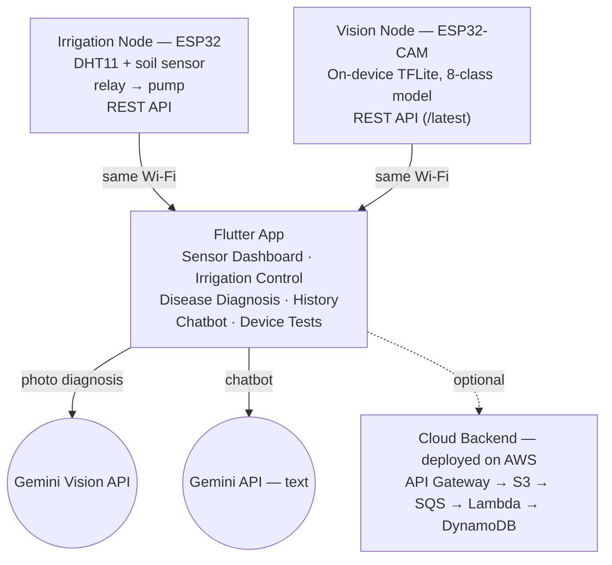

# Smart Agriculture System with Plant Disease Detection

A dual-node IoT + AI system: automated soil-moisture irrigation, and
on-device + cloud tomato leaf disease diagnosis, unified in one
Flutter mobile app backed by an optional serverless AWS pipeline.

[](https://github.com/FURYBALA/smart-agriculture-system/actions/workflows/firmware-compile.yml)
[](https://github.com/FURYBALA/smart-agriculture-system/actions/workflows/flutter-ci.yml)
[](https://github.com/FURYBALA/smart-agriculture-system/actions/workflows/backend-ci.yml)
[](https://github.com/FURYBALA/smart-agriculture-system/actions/workflows/wokwi-simulation.yml)
[](LICENSE)

Built for **21ECC301P — Microprocessor, Microcontroller and Interfacing
Techniques**, SRM Institute of Science and Technology. Team and guide
in [`docs/team.md`](docs/team.md).

> This repo rebuilds the team's original project report into working,
> version-controlled code. Not every piece could be reproduced exactly
> as reported (no access to the original Edge Impulse project, no AWS
> account to deploy to) — every substitution is documented plainly in
> [`docs/differences-from-report.md`](docs/differences-from-report.md).
> Nothing here claims results it didn't actually produce.

## At a glance

| | |
|---|---|
| **Live AWS API** | [`https://p17huf2s49.execute-api.ap-south-1.amazonaws.com/prod/`](https://p17huf2s49.execute-api.ap-south-1.amazonaws.com/prod/diagnose) — deployed, region `ap-south-1`, stack `smart-agriculture-system` |
| **Try it now (no hardware needed)** | [`docs/demo-guide.md`](docs/demo-guide.md) — 5-minute and 10-minute walkthroughs using Wokwi + Flutter web + the live AWS API |
| **What's real vs. simulated** | [Verification status](#verification-status) below, and [`docs/final-validation-matrix.md`](docs/final-validation-matrix.md) |
| **For recruiters / reviewers** | [`docs/project-presentation.md`](docs/project-presentation.md) (30s–5min explanations), [`docs/resume-project-entry.md`](docs/resume-project-entry.md), [`docs/interview-preparation.md`](docs/interview-preparation.md) |
| **Stack** | ESP32 · ESP32-CAM · TensorFlow Lite Micro · Flutter · AWS Lambda/API Gateway/S3/SQS/DynamoDB · GitHub Actions · Wokwi |

## Highlights

- **Two independent ESP32 nodes** — a plain ESP32 running closed-loop
  soil-moisture irrigation, and an ESP32-CAM running on-device leaf
  disease classification — each with its own REST API.
- **Custom 8-class CNN**, trained from scratch and INT8-quantized to
  69.9 KB for on-device TFLite Micro inference.
- **Flutter app** (6 screens) unifying both nodes plus cloud AI:
  live sensor dashboard, manual/auto irrigation control, photo
  diagnosis via Gemini Vision, local history, a plant-care chatbot,
  and device connectivity tests.
- **Deployed and verified AWS backend** (API Gateway → S3 → SQS →
  Lambda → DynamoDB) as a self-hosted alternative inference path,
  written as real infrastructure-as-code and actually running in a
  real AWS account, not a mockup — see
  [`backend/README.md`](backend/README.md#deployed-instance) below.
- **CI on every push**: both firmware sketches compile-checked against
  real ESP32 board definitions, their hardware-independent logic
  host-tested with a plain C++ compiler, the Flutter app analyzed/
  tested/web-built, and the backend's real Lambda handlers exercised
  against moto-mocked AWS plus a real `sam build --use-container`.
- **No physical ESP32 or mobile device was available** to build this
  against — so alongside the real implementation, this repo also has a
  local ESP32 REST simulator and a moto-based AWS test harness that
  exercise the real app and backend code end-to-end without either.
  Both are dev/test aids, not a substitute for the physical hardware
  validation still pending — see
  [**Local simulation & testing**](#local-simulation--testing) below.
  A real AWS deployment and a real headless-browser Flutter runtime
  (see [**External validation**](#external-validation)) close the two
  gaps that used to require hardware/an account to close.

## Architecture



The two ESP32 nodes talk to the phone directly over the local Wi-Fi
network — irrigation control keeps working even if the internet is
down. The cloud backend is a separate, optional path: the app's
primary diagnosis flow calls Gemini Vision directly from the phone and
needs no backend at all.

## Repository structure

```
firmware/
  irrigation_node/   ESP32: sensing + pump control + REST API
  vision_node/        ESP32-CAM: on-device disease classification (TFLite Micro)
  test/                host-side tests for both nodes' hardware-independent logic
ml/
  scripts/             download_dataset.py -> train.py -> convert_tflite.py
  models/              trained model + metrics (generated by the scripts above)
mobile_app/            Flutter app, all 6 modules
  tool/                 local ESP32 REST simulator (dev/test aid, see below)
backend/                AWS SAM cloud backend (deployed and verified)
  tests/                Lambda handler tests against moto-mocked AWS
docs/                   team, architecture, wiring, dataset investigation, bring-up,
                        host/backend/Wokwi/Flutter-web local testing notes
```

## Technology stack

| Layer | Technologies |
|---|---|
| Embedded / Firmware | C++ (Arduino framework), ESP32 / ESP32-CAM, TensorFlow Lite for Microcontrollers, ArduinoJson |
| Mobile | Flutter, Dart, Provider, sqflite, `google_generative_ai` (Gemini) |
| ML | Python, TensorFlow/Keras, TFLite INT8 quantization, PlantVillage dataset |
| Backend | AWS Lambda (Python 3.12), API Gateway, S3, SQS, DynamoDB, AWS SAM |
| CI/CD | GitHub Actions, `arduino-cli`, AWS SAM CLI, `flutter analyze` / `flutter test` / `flutter build web` |
| Testing | Flutter unit + integration tests, host-side C++ tests (`g++`), Python `pytest` + `moto` |

## Key engineering work

Real problems found and fixed, not just features written:

- **PSRAM tensor-arena allocation.** A 250 KB TFLite Micro arena as a
  static array overflowed the ESP32's ~320 KB of internal DRAM by
  ~186 KB once WiFi/WebServer buffers were counted — caught by CI, not
  guesswork. Fixed by allocating it in PSRAM via `heap_caps_malloc`.
- **RGB565 byte-order bug.** The ESP32 camera driver emits RGB565
  pixels big-endian; reading them through a native `uint16_t*` cast
  silently byte-swapped every pixel. Fixed by combining the two bytes
  explicitly in `preprocessFrame()`.
- **A biased evaluation sample, not quantization, was hiding a real
  model weakness.** Quantized accuracy looked far worse than float
  (~18-point drop). Root-caused by comparing float vs. quantized
  predictions image-by-image (99.2% agreement, ruling out
  quantization) — the actual bug was an alphabetically-last-N
  evaluation slice, not a random sample. Fixing the sampling surfaced
  the real issue (two classes stuck near chance level) and doubling
  their training data measurably improved both. Full writeup with the
  rejected follow-up experiments: [`docs/dataset.md`](docs/dataset.md#results).
- **DynamoDB `Decimal` requirement.** `boto3`'s `TypeSerializer`
  rejects native Python `float` outright — a pre-existing bug that
  silently failed every successful inference write. Fixed with an
  explicit `Decimal(str(value))` conversion.
- **Shared Lambda Layer.** The `json_response` helper was duplicated
  across all four Lambda functions; consolidated into one
  `common_layer` referenced via SAM's `Layers:` rather than copy-pasted.
- **Origin-tracked pump safety timer.** Gating the auto-shutoff timer
  on "current mode == AUTO" has a hole: switching to manual mid-cycle
  would silently disable the cutoff and leave the pump running
  indefinitely. Fixed by tracking *who* started the pump
  (`pumpStartedByAuto`), not the current mode.
- **`tflite-runtime` has been removed from PyPI entirely.** Found while
  testing the backend locally, not assumed:
  `pip index versions tflite-runtime` returns no distributions at all.
  The Lambda inference function depended on it and could never have
  been deployed as written. Fixed by switching to `ai-edge-litert`,
  Google's drop-in-compatible successor.
- **A raw parser exception was reaching the UI.** The local ESP32
  simulator's `malformed` scenario found that `Esp32Service.fetchSensors()`
  let a `FormatException` escape instead of the `Esp32Exception` type
  the UI expects — `sensor_dashboard_screen.dart` interpolates the
  caught error directly into displayed text, so a corrupted device
  response would have shown the user a raw stack trace. Fixed by
  wrapping every JSON decode in the service with consistent error
  handling.

## Local simulation & testing

No physical ESP32/ESP32-CAM, mobile device/emulator, or AWS account was
available while building this — so alongside the real implementation,
this repo has real dev/test infrastructure that exercises as much of
the actual code as possible without any of them. None of this replaces
physical/cloud validation; see **External validation** below for what
still does.

| What | How | Proves |
|---|---|---|
| Firmware logic | Pure state-machine/math extracted into [`irrigation_logic.h`](firmware/irrigation_node/irrigation_logic.h)/[`vision_logic.h`](firmware/vision_node/vision_logic.h), tested with a plain `g++` in CI (no ESP32 needed) | Pump timer, thresholds, RGB565 decode, INT8 quantize/dequantize behave correctly — see [`docs/host-testing.md`](docs/host-testing.md) |
| ESP32 REST contract | [`mobile_app/tool/esp32_simulator_lib.dart`](mobile_app/tool/esp32_simulator_lib.dart) serves the exact same JSON/status codes as both real nodes | The real, unmodified `Esp32Service` talking to it over real loopback HTTP — [`docs/simulation.md`](docs/simulation.md) |
| Backend Lambda handlers | [`backend/tests/test_lambda_handlers_local.py`](backend/tests/test_lambda_handlers_local.py), `moto`-mocked S3/SQS/DynamoDB | Real request validation/serialization/error handling in `upload_handler`, `results_handler`, `chat_handler` — [`docs/backend-local-testing.md`](docs/backend-local-testing.md) |
| ML inference | Same test file, real `ai-edge-litert` interpreter loading the actual shipped `.tflite` model | Input/output tensor shapes and quantization match `training_metadata.json`; a full S3→preprocess→invoke→DynamoDB run returns a valid class + confidence |
| Backend deployment | `sam validate` + `sam build --use-container` in CI, then a real `sam deploy` via a manual GitHub Actions workflow | **Deployed for real** to `ap-south-1` — 21/21 resources `CREATE_COMPLETE`, a live API smoke test passing end-to-end |
| Flutter web | `flutter build web` in CI | The app's non-platform-specific code compiles cleanly — see [`docs/flutter-runtime.md`](docs/flutter-runtime.md) for what this does and doesn't prove |
| ESP32 hardware bring-up simulation | [Wokwi](https://wokwi.com) config for the irrigation node, run with a real token against Wokwi's real API | ✅ **Passing, locally and in GitHub Actions** — root-caused a real missing `diagram.json` serial-monitor connection (not a firmware or environment issue as earlier attempts suggested) and fixed it; the real compiled firmware boots and prints a deterministic `WOKWI_IRRIGATION_READY` marker, confirmed by `--expect-text` on this machine and independently on a clean `ubuntu-latest` GitHub Actions runner ([run `32560846142`](https://github.com/FURYBALA/smart-agriculture-system/actions/runs/32560846142)); see [`docs/wokwi-simulation.md`](docs/wokwi-simulation.md) for the full diagnosis and history |

## ML model

- **Task**: 8-class tomato leaf disease classification from a single
  96×96 RGB frame.
- **Classes**: Bacterial Spot, Early Blight, Healthy, Late Blight,
  Septoria Leaf Spot, Spider Mite, TYLCV, Target Spot.
- **Data**: 3,200 images (400/class) from PlantVillage — see
  [`docs/dataset.md`](docs/dataset.md) for the exact source-class
  mapping and one documented substitution (Bacterial Speck →
  Bacterial Spot, the closest available proxy).
- **Model**: custom CNN (4 conv blocks, global average pooling, ~61K
  params), trained from scratch with Keras.
- **Quantization**: post-training INT8, converted to a 69.9 KB TFLite
  file for TFLite Micro on the ESP32-CAM; the same `.tflite` file is
  reused by the optional cloud inference Lambda.

## Project results

Documented evaluation results from model development — measured on
held-out PlantVillage images during training and quantization, **not
a measurement of real-world field accuracy**. Real garden photos have
cluttered backgrounds and lighting that PlantVillage's cropped,
plain-background images don't.

- **Validation accuracy (float model)**: **81.9%**
- **Quantized (INT8) model**: 69.9 KB, **65.8%** spot-check accuracy
  on 240 held-out images
- **Float-vs-quantized prediction agreement**: **99.2%** — confirms
  the accuracy gap between float and quantized was not caused by
  quantization itself (see methodology below)
- **Spider Mite / Target Spot improvement**: both classes went from
  ~13% (near chance level for an 8-class problem) to **40.0%** and
  **43.3%** respectively after doubling their training data — a real,
  measured improvement, though both remain the two weakest of the
  eight classes

**Methodology.** Quantized accuracy initially looked far worse than
float — an ~18-point drop. Rather than assume quantization was the
cause, float and quantized predictions were compared image-by-image:
99.2% agreement ruled quantization out. The actual cause was a biased
evaluation sample (an alphabetically-last-N slice of files, not a
random one). Fixing the sampling exposed the real issue underneath it:
two classes stuck near chance level. Doubling their training data was
tried as a direct remediation and measurably improved both. Two
further attempts to close the remaining gap — an imbalanced
1,000-image oversample, and class-weighted loss — were tried and both
made results *worse*, and are documented rather than discarded. Full
step-by-step writeup, per-class accuracy tables, and the
confusion-matrix root-cause analysis:
[`docs/dataset.md`](docs/dataset.md#results).

## Known limitations

- **Spider Mite and Target Spot remain the model's weakest classes**
  (40.0% / 43.3%, vs. 63–90% for the other six — see Project results
  above). Root-caused via confusion matrix: both diseases' visual
  features overlap heavily with Septoria Leaf Spot specifically (not
  with each other), which looks like an architectural/
  feature-resolution limit rather than a fixable data or training bug.
- **PlantVillage vs. real-world images.** The model has not been
  evaluated on photos taken in an actual garden; expect a real
  accuracy drop until fine-tuned on real deployment images (noted in
  [`docs/bring-up-checklist.md`](docs/bring-up-checklist.md)).
- **No live MJPEG stream from the vision node.** The original report's
  plan (streaming video to the app) was unreliable on this hardware;
  the app instead polls the node's latest single classification
  result over REST. See
  [`docs/differences-from-report.md`](docs/differences-from-report.md).

## Verification status

| Component | Verification | Status |
|---|---|---|
| Firmware (both nodes) | Compiled in CI (`arduino-cli`) against real ESP32 board definitions on every push | ✅ Build-verified |
| Firmware logic | Hardware-independent pump/threshold/RGB565/quantization math, host-tested with `g++` in CI | ✅ Logic-verified |
| Flutter app | `flutter analyze` (clean) + `flutter test` (19 tests, including a real ESP32-simulator integration test) + `flutter build web` in CI | ✅ Passing |
| Flutter release APK | `flutter build apk --release` — locally, not CI (needs a full Android SDK) | ✅ Builds a real, installable 20.7 MB APK, after fixing a real Gradle 7→8/Kotlin/JDK 21 mismatch |
| Backend (Lambda / SAM) | `sam validate`, `sam build --use-container` (real Docker, full stack) in CI; real handler code run against `moto`-mocked AWS (19 `pytest` tests) | ✅ Locally verified |
| **AWS deployment** | **Deployed for real** via a manual GitHub Actions workflow (`ap-south-1`, stack `smart-agriculture-system`) — all 21 resources `CREATE_COMPLETE`; a real API smoke test (upload → S3 → SQS → real model inference → DynamoDB → poll) and the chat endpoints both verified against the live API; found and fixed a real Lambda Layer packaging bug in the process | ✅ **Deployed and verified** — see [`docs/DEPLOYMENT.md`](docs/DEPLOYMENT.md#6-deploy-aws-backend-optional) |
| ML inference | Real `.tflite` model loaded and run through `ai-edge-litert` — locally, and for real in the deployed Lambda; tensor shapes/quantization cross-checked against `training_metadata.json` | ✅ Runs correctly — see caveat below |
| ML pipeline consistency | Class-label order and quantization params cross-checked across firmware headers, backend, and training metadata | ✅ Consistent |
| ESP32 hardware bring-up simulation | Wokwi simulation, run with a real token, locally and in GitHub Actions | ✅ **Passing in both** — root cause found (a missing `diagram.json` serial-monitor wiring, not a firmware/environment problem as two earlier attempts suggested) and fixed; real firmware boots and prints a deterministic boot marker, confirmed by `--expect-text`, exit code 0, on this machine and independently on a clean `ubuntu-latest` GitHub Actions runner ([run `32560846142`](https://github.com/FURYBALA/smart-agriculture-system/actions/runs/32560846142)) — see [`docs/wokwi-simulation.md`](docs/wokwi-simulation.md) |
| Physical ESP32/ESP32-CAM hardware | Flashing and hardware bring-up | ⏳ Pending — no hardware available in the development environment |
| Flutter web runtime | A real, isolated headless Chromium (via Playwright) actually loading the built app and clicking through all 6 screens | ✅ **Runs correctly** — 0 uncaught exceptions; found and fixed a real bug along the way (History screen's database didn't work at all on web) — see [`docs/flutter-runtime.md`](docs/flutter-runtime.md) |
| Mobile native runtime | Running on a physical Android/iOS device or emulator | ⏳ Pending — no device/emulator available in the development environment |

"Build-verified," "logic-verified," and "locally verified" are
deliberately not written as "tested on hardware" or "deployed" — see
**External validation** below. "Runs correctly" for ML inference means
the pipeline executes correctly end-to-end through the real model; it
is not a claim about prediction accuracy on any specific image — that's
what [`docs/dataset.md`](docs/dataset.md)'s real PlantVillage spot-check
measures.

## Getting started

For the complete start-from-zero setup across every component in one
place — including AWS deployment steps and a troubleshooting table —
see [`docs/DEPLOYMENT.md`](docs/DEPLOYMENT.md). The full test matrix
(what's verified vs. still blocked, per test case) is
[`docs/end-to-end-test-plan.md`](docs/end-to-end-test-plan.md), and the
checklist to work through once physical hardware is available is
[`docs/hardware-validation-checklist.md`](docs/hardware-validation-checklist.md).

Each component also has its own focused setup doc:

- **Firmware**: [`docs/wiring.md`](docs/wiring.md) (pinout, power)
  then [`docs/bring-up-checklist.md`](docs/bring-up-checklist.md)
  (library install, flashing, first-boot checks). Host-side logic
  tests (no board needed):
  [`docs/host-testing.md`](docs/host-testing.md).
- **ML pipeline**: [`docs/dataset.md`](docs/dataset.md) —
  `pip install -r ml/requirements.txt`, then `download_dataset.py` →
  `train.py` → `convert_tflite.py`
- **Mobile app**:
  ```bash
  cd mobile_app
  flutter pub get
  cp .env.example .env   # fill in your own Gemini API key + node IPs
  flutter analyze && flutter test
  flutter run
  ```
  No ESP32 hardware yet? Run the local simulator
  ([`docs/simulation.md`](docs/simulation.md)) and point `.env` at it
  instead:
  ```bash
  dart run tool/esp32_simulator.dart
  ```
- **Backend** (optional — the app's default diagnosis path doesn't need it): [`backend/README.md`](backend/README.md)
  — already deployed once for real, see below; `sam build --use-container && sam deploy --guided`
  deploys your own copy, requires your own AWS account and credentials.
  Local testing without either (`pytest`, real handler code,
  `moto`-mocked AWS): [`docs/backend-local-testing.md`](docs/backend-local-testing.md).

## External validation

Everything above was verified through compilation, static analysis,
and automated tests in the development environment — plus, as of this
pass, a real AWS deployment and a real browser runtime. What remains
genuinely external is narrower than it used to be:

- **ESP32 / ESP32-CAM hardware.** No physical board was available, so
  neither node has been flashed or bring-up tested. Firmware compiling
  cleanly in CI and its logic passing host-side tests are verified;
  behaving correctly on real hardware (sensors, relay wiring, camera,
  Wi-Fi, timing) is not — go through
  [`docs/bring-up-checklist.md`](docs/bring-up-checklist.md) before a
  first flash rather than assuming it. A Wokwi simulation for the
  irrigation node **now genuinely passes**: two earlier attempts
  (real token, real API, real firmware) each connected but stalled with
  zero serial output, including with an independent trivial sanity
  sketch, which looked like an environment/service limitation. It
  wasn't -- diffing against Wokwi's own official example project found
  the real cause (a missing serial-monitor connection in
  `diagram.json`), and with that fixed, the real compiled firmware
  boots and prints a deterministic marker every time, confirmed by
  `wokwi-cli --expect-text` -- both locally and independently in
  GitHub Actions on a clean `ubuntu-latest` runner
  ([run `32560846142`](https://github.com/FURYBALA/smart-agriculture-system/actions/runs/32560846142)),
  so this isn't a result tied to one machine. This only ever validates
  boot/Serial/GPIO behavior in simulation, not real camera, real
  relay/pump electrical behavior, real soil sensor accuracy, or real
  hardware timing/Wi-Fi behavior — and Wokwi has no camera/image-sensor
  simulation component at all, so ESP32-CAM vision simulation isn't
  attempted or claimed — see
  [`docs/wokwi-simulation.md`](docs/wokwi-simulation.md) for the full
  history and exactly what is and isn't covered.
- **Flutter on a physical device or emulator.** No physical Android/iOS
  device or emulator was available, so the release APK
  (`flutter build apk --release`, a real, verified 20.7MB file after
  fixing a real Gradle/Kotlin/JDK version mismatch) has never actually
  been installed and watched run there. The **web** runtime is no
  longer part of this gap: a real, isolated headless Chromium (via
  Playwright) actually loaded the built app and was driven through all
  6 screens, screenshotting each, with zero uncaught exceptions — and
  that process found and fixed a real bug (`HistoryScreen`'s database
  didn't work on web at all) rather than leaving it as an open
  question. See [`docs/flutter-runtime.md`](docs/flutter-runtime.md)
  for the full account, screenshots' contents, and exactly what's still
  unconfirmed (a populated diagnosis/history list was never observed,
  since no data was saved through the real UI in this pass).

**AWS deployment is no longer on this list** — the backend is deployed
and verified for real (stack `smart-agriculture-system`, `ap-south-1`):
see [`backend/README.md`](backend/README.md#deployed-instance) and
[`docs/DEPLOYMENT.md`](docs/DEPLOYMENT.md#deployed-instance) for the
account, the live API URL, exactly what was checked, and a real bug
that deployment found and fixed (a doubly-nested Lambda Layer path that
no local test could have caught). What that deployment does *not*
prove: the firmware doesn't call this API at all (see the architecture
diagram), and the mobile app's own diagnosis path still calls Gemini
Vision directly, unchanged.

## Skills demonstrated

Grounded in the specific, verified work in this repository, not a
generic list:

- **Embedded systems**: C++ on ESP32 (Arduino framework), REST API
  design over `WebServer`, sensor drivers (DHT11, analog ADC),
  relay/GPIO control with a real safety timer state machine, PSRAM
  memory management for a TFLite Micro tensor arena, RGB565 camera
  frame decoding
- **Machine learning**: CNN design and training from scratch (Keras),
  post-training INT8 quantization for microcontroller deployment,
  root-causing an accuracy regression via image-by-image float-vs-
  quantized comparison rather than assuming the obvious cause
- **Mobile development**: Flutter/Dart, `Provider` state management,
  platform-conditional persistence (`sqflite` native vs.
  `sqflite_common_ffi_web` on web), async integration testing against
  a local protocol-accurate simulator
- **Cloud/backend**: AWS serverless architecture (API Gateway, Lambda,
  S3, SQS, DynamoDB) as infrastructure-as-code (SAM), async
  upload→queue→process→poll pipeline design, IAM least-privilege
  policy scoping, real deployment via GitHub Actions with masked
  secrets
- **DevOps/CI**: 5 GitHub Actions workflows (firmware, Flutter,
  backend, AWS deploy, Wokwi simulation), multi-language test
  automation (C++, Dart, Python), root-causing CI-only failures (a
  `moto`/real-credential test-ordering conflict, a Lambda Layer
  double-nesting bug) that, by definition, never reproduced locally
- **Testing discipline**: host-side unit tests for hardware-independent
  logic, integration tests against a real protocol-accurate simulator,
  real headless-browser end-to-end testing (Playwright), and a written
  policy against claiming untested capabilities as working — enforced
  throughout this README and every doc it links to

## Documentation index

| Doc | What it's for |
|---|---|
| [`docs/demo-guide.md`](docs/demo-guide.md) | Step-by-step demo procedure — no physical hardware needed |
| [`docs/project-presentation.md`](docs/project-presentation.md) | 30-second to 5-minute spoken explanations, by audience/topic |
| [`docs/interview-preparation.md`](docs/interview-preparation.md) | Likely technical interview questions with concise answers |
| [`docs/resume-project-entry.md`](docs/resume-project-entry.md) | Resume bullet variants and ATS keywords |
| [`docs/linkedin-project-post.md`](docs/linkedin-project-post.md) | A draft project announcement post |
| [`docs/final-validation-matrix.md`](docs/final-validation-matrix.md) | Every component's real status: PASS / SIMULATED / BLOCKED / NOT SUPPORTED |
| [`docs/DEPLOYMENT.md`](docs/DEPLOYMENT.md) | Full start-from-zero setup, every component |
| [`docs/end-to-end-test-plan.md`](docs/end-to-end-test-plan.md) | The complete test matrix, per test case |
| [`docs/differences-from-report.md`](docs/differences-from-report.md) | What was rebuilt vs. carried over from the original report |

## License

MIT — see [LICENSE](LICENSE). The tomato disease training dataset is a
separately-licensed subset of PlantVillage (Hughes & Salathe, 2015);
see [`docs/dataset.md`](docs/dataset.md) for attribution and citation.
The MIT license covers the original code in this repository only.

## Team

Built by a team of three for 21ECC301P at SRM Institute of Science and
Technology, under guide Dr. Rajalakshmi T. Full names, registration
numbers, and a note on what was rebuilt vs. carried over from the
original report: [`docs/team.md`](docs/team.md).
