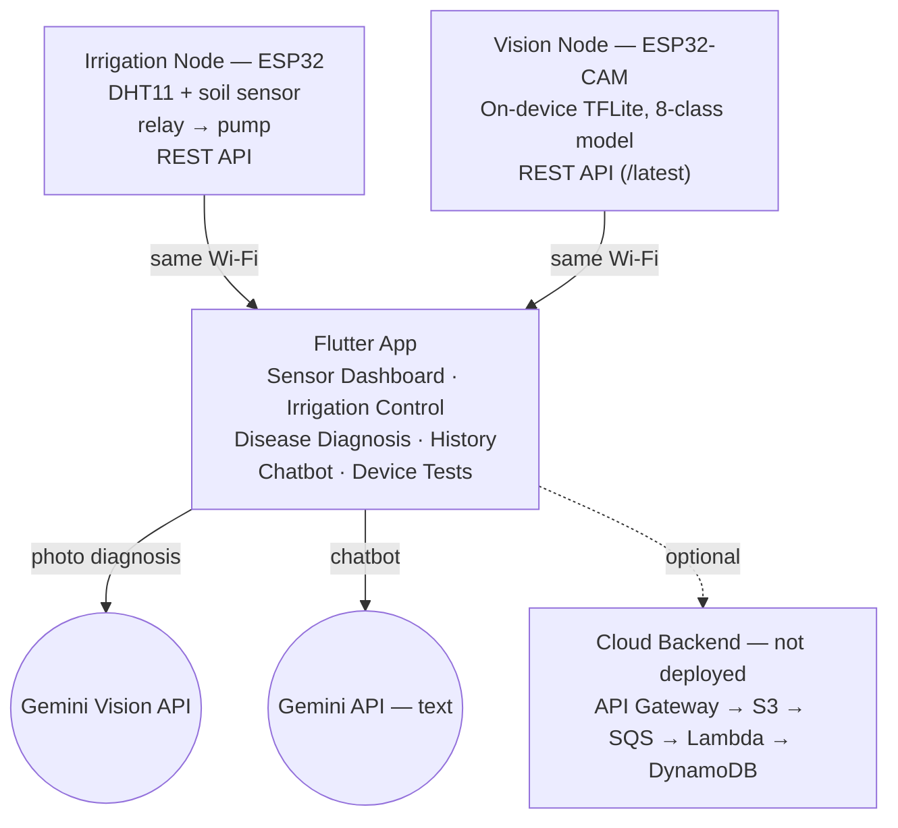

# Smart Agriculture System with Plant Disease Detection

A dual-node IoT + AI system: automated soil-moisture irrigation, and
on-device + cloud tomato leaf disease diagnosis, unified in one
Flutter mobile app backed by an optional serverless AWS pipeline.

[](https://github.com/FURYBALA/smart-agriculture-system/actions/workflows/firmware-compile.yml)
[](https://github.com/FURYBALA/smart-agriculture-system/actions/workflows/flutter-ci.yml)
[](LICENSE)

Built for **21ECC301P — Microprocessor, Microcontroller and Interfacing
Techniques**, SRM Institute of Science and Technology. Team and guide
in [`docs/team.md`](docs/team.md).

> This repo rebuilds the team's original project report into working,
> version-controlled code. Not every piece could be reproduced exactly
> as reported (no access to the original Edge Impulse project, no AWS
> account to deploy to) — every substitution is documented plainly in
> [`docs/differences-from-report.md`](docs/differences-from-report.md).
> Nothing here claims results it didn't actually produce.

## Highlights

- **Two independent ESP32 nodes** — a plain ESP32 running closed-loop
  soil-moisture irrigation, and an ESP32-CAM running on-device leaf
  disease classification — each with its own REST API.
- **Custom 8-class CNN**, trained from scratch and INT8-quantized to
  69.9 KB for on-device TFLite Micro inference.
- **Flutter app** (6 screens) unifying both nodes plus cloud AI:
  live sensor dashboard, manual/auto irrigation control, photo
  diagnosis via Gemini Vision, local history, a plant-care chatbot,
  and device connectivity tests.
- **Deployable-but-undeployed AWS backend** (API Gateway → S3 → SQS →
  Lambda → DynamoDB) as a self-hosted alternative inference path,
  written as real infrastructure-as-code, not a mockup.
- **CI on every push**: both firmware sketches compile-checked against
  real ESP32 board definitions; the Flutter app is analyzed and
  tested automatically.

## Architecture



The two ESP32 nodes talk to the phone directly over the local Wi-Fi
network — irrigation control keeps working even if the internet is
down. The cloud backend is a separate, optional path: the app's
primary diagnosis flow calls Gemini Vision directly from the phone and
needs no backend at all.

## Repository structure

```
firmware/
  irrigation_node/   ESP32: sensing + pump control + REST API
  vision_node/        ESP32-CAM: on-device disease classification (TFLite Micro)
ml/
  scripts/             download_dataset.py -> train.py -> convert_tflite.py
  models/              trained model + metrics (generated by the scripts above)
mobile_app/            Flutter app, all 6 modules
backend/                AWS SAM cloud backend (not deployed)
docs/                   team, architecture, wiring, dataset investigation, bring-up
```

## Technology stack

| Layer | Technologies |
|---|---|
| Embedded / Firmware | C++ (Arduino framework), ESP32 / ESP32-CAM, TensorFlow Lite for Microcontrollers, ArduinoJson |
| Mobile | Flutter, Dart, Provider, sqflite, `google_generative_ai` (Gemini) |
| ML | Python, TensorFlow/Keras, TFLite INT8 quantization, PlantVillage dataset |
| Backend | AWS Lambda (Python 3.12), API Gateway, S3, SQS, DynamoDB, AWS SAM |
| CI/CD | GitHub Actions, `arduino-cli`, `flutter analyze` / `flutter test` |
| Testing | Flutter unit + widget tests, Python `py_compile` checks |

## Key engineering work

Real problems found and fixed, not just features written:

- **PSRAM tensor-arena allocation.** A 250 KB TFLite Micro arena as a
  static array overflowed the ESP32's ~320 KB of internal DRAM by
  ~186 KB once WiFi/WebServer buffers were counted — caught by CI, not
  guesswork. Fixed by allocating it in PSRAM via `heap_caps_malloc`.
- **RGB565 byte-order bug.** The ESP32 camera driver emits RGB565
  pixels big-endian; reading them through a native `uint16_t*` cast
  silently byte-swapped every pixel. Fixed by combining the two bytes
  explicitly in `preprocessFrame()`.
- **A biased evaluation sample, not quantization, was hiding a real
  model weakness.** Quantized accuracy looked far worse than float
  (~18-point drop). Root-caused by comparing float vs. quantized
  predictions image-by-image (99.2% agreement, ruling out
  quantization) — the actual bug was an alphabetically-last-N
  evaluation slice, not a random sample. Fixing the sampling surfaced
  the real issue (two classes stuck near chance level) and doubling
  their training data measurably improved both. Full writeup with the
  rejected follow-up experiments: [`docs/dataset.md`](docs/dataset.md#results).
- **DynamoDB `Decimal` requirement.** `boto3`'s `TypeSerializer`
  rejects native Python `float` outright — a pre-existing bug that
  silently failed every successful inference write. Fixed with an
  explicit `Decimal(str(value))` conversion.
- **Shared Lambda Layer.** The `json_response` helper was duplicated
  across all four Lambda functions; consolidated into one
  `common_layer` referenced via SAM's `Layers:` rather than copy-pasted.
- **Origin-tracked pump safety timer.** Gating the auto-shutoff timer
  on "current mode == AUTO" has a hole: switching to manual mid-cycle
  would silently disable the cutoff and leave the pump running
  indefinitely. Fixed by tracking *who* started the pump
  (`pumpStartedByAuto`), not the current mode.

## ML model

- **Task**: 8-class tomato leaf disease classification from a single
  96×96 RGB frame.
- **Classes**: Bacterial Spot, Early Blight, Healthy, Late Blight,
  Septoria Leaf Spot, Spider Mite, TYLCV, Target Spot.
- **Data**: 3,200 images (400/class) from PlantVillage — see
  [`docs/dataset.md`](docs/dataset.md) for the exact source-class
  mapping and one documented substitution (Bacterial Speck →
  Bacterial Spot, the closest available proxy).
- **Model**: custom CNN (4 conv blocks, global average pooling, ~61K
  params), trained from scratch with Keras.
- **Quantization**: post-training INT8, converted to a 69.9 KB TFLite
  file for TFLite Micro on the ESP32-CAM; the same `.tflite` file is
  reused by the optional cloud inference Lambda.

## Project results

Documented evaluation results from model development — measured on
held-out PlantVillage images during training and quantization, **not
a measurement of real-world field accuracy**. Real garden photos have
cluttered backgrounds and lighting that PlantVillage's cropped,
plain-background images don't.

- **Validation accuracy (float model)**: **81.9%**
- **Quantized (INT8) model**: 69.9 KB, **65.8%** spot-check accuracy
  on 240 held-out images
- **Float-vs-quantized prediction agreement**: **99.2%** — confirms
  the accuracy gap between float and quantized was not caused by
  quantization itself (see methodology below)
- **Spider Mite / Target Spot improvement**: both classes went from
  ~13% (near chance level for an 8-class problem) to **40.0%** and
  **43.3%** respectively after doubling their training data — a real,
  measured improvement, though both remain the two weakest of the
  eight classes

**Methodology.** Quantized accuracy initially looked far worse than
float — an ~18-point drop. Rather than assume quantization was the
cause, float and quantized predictions were compared image-by-image:
99.2% agreement ruled quantization out. The actual cause was a biased
evaluation sample (an alphabetically-last-N slice of files, not a
random one). Fixing the sampling exposed the real issue underneath it:
two classes stuck near chance level. Doubling their training data was
tried as a direct remediation and measurably improved both. Two
further attempts to close the remaining gap — an imbalanced
1,000-image oversample, and class-weighted loss — were tried and both
made results *worse*, and are documented rather than discarded. Full
step-by-step writeup, per-class accuracy tables, and the
confusion-matrix root-cause analysis:
[`docs/dataset.md`](docs/dataset.md#results).

## Known limitations

- **Spider Mite and Target Spot remain the model's weakest classes**
  (40.0% / 43.3%, vs. 63–90% for the other six — see Project results
  above). Root-caused via confusion matrix: both diseases' visual
  features overlap heavily with Septoria Leaf Spot specifically (not
  with each other), which looks like an architectural/
  feature-resolution limit rather than a fixable data or training bug.
- **PlantVillage vs. real-world images.** The model has not been
  evaluated on photos taken in an actual garden; expect a real
  accuracy drop until fine-tuned on real deployment images (noted in
  [`docs/bring-up-checklist.md`](docs/bring-up-checklist.md)).
- **No live MJPEG stream from the vision node.** The original report's
  plan (streaming video to the app) was unreliable on this hardware;
  the app instead polls the node's latest single classification
  result over REST. See
  [`docs/differences-from-report.md`](docs/differences-from-report.md).

## Verification status

| Component | Verification | Status |
|---|---|---|
| Firmware (both nodes) | Compiled in CI (`arduino-cli`) against real ESP32 board definitions on every push | ✅ Build-verified |
| Flutter app | `flutter analyze` (clean) + `flutter test` (8 tests) in CI on every push | ✅ Passing |
| Backend (Lambda / SAM) | Full manual code review, all Python files syntax-checked (`py_compile`) | ✅ Reviewed — not deployed |
| ML pipeline | Class-label order, INT8 quantization params, and model size cross-checked across firmware headers, backend, and training metadata | ✅ Consistent |
| Physical ESP32/ESP32-CAM hardware | Flashing and hardware bring-up | ⏳ Pending — no hardware available in the development environment |
| Mobile runtime | Running on a physical device/emulator | ⏳ Pending — no device/emulator available in the development environment |
| AWS deployment | `sam deploy` | ⏳ Pending — no AWS credentials/account available |

"Build-verified" and "reviewed" are deliberately not written as
"tested on hardware" — see **External validation** below.

## Getting started

Each component has its own setup; see the linked doc for full detail.

- **Firmware**: [`docs/wiring.md`](docs/wiring.md) (pinout, power)
  then [`docs/bring-up-checklist.md`](docs/bring-up-checklist.md)
  (library install, flashing, first-boot checks)
- **ML pipeline**: [`docs/dataset.md`](docs/dataset.md) —
  `pip install -r ml/requirements.txt`, then `download_dataset.py` →
  `train.py` → `convert_tflite.py`
- **Mobile app**:
  ```bash
  cd mobile_app
  flutter pub get
  cp .env.example .env   # fill in your own Gemini API key + node IPs
  flutter analyze && flutter test
  flutter run
  ```
- **Backend** (optional, not deployed): [`backend/README.md`](backend/README.md)
  — `sam build --use-container && sam deploy --guided`, requires your
  own AWS account and credentials.

## External validation

Everything above was verified through compilation, static analysis,
and automated tests in the development environment. Three things were
not, because the required resources weren't available there:

- **ESP32 / ESP32-CAM hardware.** No physical board was available, so
  neither node has been flashed or bring-up tested. Firmware
  compiling cleanly in CI is verified; behaving correctly on real
  hardware is not — go through
  [`docs/bring-up-checklist.md`](docs/bring-up-checklist.md) before a
  first flash rather than assuming it.
- **Flutter on a real device or emulator.** No Android/iOS emulator,
  Chrome, or Visual Studio C++ toolchain was available. `flutter
  analyze` and `flutter test` pass; the app has not been run.
- **AWS deployment.** No AWS account/credentials were available.
  `backend/` is real, deployable SAM infrastructure, but `sam deploy`
  has never been run against it — see
  [`backend/README.md`](backend/README.md) for what another engineer
  with credentials would need to deploy it.

## License

MIT — see [LICENSE](LICENSE). The tomato disease training dataset is a
separately-licensed subset of PlantVillage (Hughes & Salathe, 2015);
see [`docs/dataset.md`](docs/dataset.md) for attribution and citation.
The MIT license covers the original code in this repository only.

## Team

Built by a team of three for 21ECC301P at SRM Institute of Science and
Technology, under guide Dr. Rajalakshmi T. Full names, registration
numbers, and a note on what was rebuilt vs. carried over from the
original report: [`docs/team.md`](docs/team.md).
